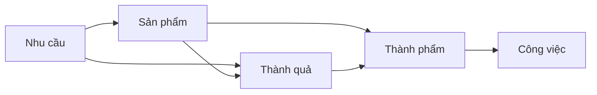

[Dựa vào KPI thì bộ phận kinh doanh sẽ có tiếng nói lớn nhất, còn đội phát triển sản phẩm rất ít có tiếng nói](../../Ph%C3%A1t%20tri%E1%BB%83n%20s%E1%BA%A3n%20ph%E1%BA%A9m/Ch%E1%BB%89%20s%E1%BB%91/D%E1%BB%B1a%20v%C3%A0o%20KPI%20th%C3%AC%20b%E1%BB%99%20ph%E1%BA%ADn%20kinh%20doanh%20s%E1%BA%BD%20c%C3%B3%20ti%E1%BA%BFng%20n%C3%B3i%20l%E1%BB%9Bn%20nh%E1%BA%A5t,%20c%C3%B2n%20%C4%91%E1%BB%99i%20ph%C3%A1t%20tri%E1%BB%83n%20s%E1%BA%A3n%20ph%E1%BA%A9m%20r%E1%BA%A5t%20%C3%ADt%20c%C3%B3%20ti%E1%BA%BFng%20n%C3%B3i.md)
[Thành quả (outcome) là kết quả thu được do sự thay đổi về hành vi của người dùng khi tương tác với sản phẩm đã được cải tiến (hoặc sản phẩm mới)](./Th%C3%A0nh%20qu%E1%BA%A3%20(outcome)%20l%C3%A0%20k%E1%BA%BFt%20qu%E1%BA%A3%20thu%20%C4%91%C6%B0%E1%BB%A3c%20do%20s%E1%BB%B1%20thay%20%C4%91%E1%BB%95i%20v%E1%BB%81%20h%C3%A0nh%20vi%20c%E1%BB%A7a%20ng%C6%B0%E1%BB%9Di%20d%C3%B9ng%20khi%20t%C6%B0%C6%A1ng%20t%C3%A1c%20v%E1%BB%9Bi%20s%E1%BA%A3n%20ph%E1%BA%A9m%20%C4%91%C3%A3%20%C4%91%C6%B0%E1%BB%A3c%20c%E1%BA%A3i%20ti%E1%BA%BFn%20(ho%E1%BA%B7c%20s%E1%BA%A3n%20ph%E1%BA%A9m%20m%E1%BB%9Bi).md)
[❓Nhu cầu = impact = vấn đề = điểm đau = động lực = lý do bắt đầu](./%E2%9D%93Nhu%20c%E1%BA%A7u%20=%20impact%20=%20v%E1%BA%A5n%20%C4%91%E1%BB%81%20=%20%C4%91i%E1%BB%83m%20%C4%91au%20=%20%C4%91%E1%BB%99ng%20l%E1%BB%B1c%20=%20l%C3%BD%20do%20b%E1%BA%AFt%20%C4%91%E1%BA%A7u.md)
[Dữ liệu có thể là ngôn ngữ mà tất cả mọi người đều hiểu](../../../C%C3%B4ng%20ngh%E1%BB%87%20th%C3%B4ng%20tin/Khoa%20h%E1%BB%8Dc%20d%E1%BB%AF%20li%E1%BB%87u/D%E1%BB%AF%20li%E1%BB%87u%20c%C3%B3%20th%E1%BB%83%20l%C3%A0%20ng%C3%B4n%20ng%E1%BB%AF%20m%C3%A0%20t%E1%BA%A5t%20c%E1%BA%A3%20m%E1%BB%8Di%20ng%C6%B0%E1%BB%9Di%20%C4%91%E1%BB%81u%20hi%E1%BB%83u.md)

 

[Thảo luận có tính xây dựng là để tìm kiếm sự hiểu nhau, không phải để tìm kiếm sự đồng ý](../../X%C3%A2y%20d%E1%BB%B1ng%20nh%C3%B3m,%20qu%E1%BA%A3n%20l%C3%BD%20nh%C3%A2n%20s%E1%BB%B1/Th%E1%BA%A3o%20lu%E1%BA%ADn,%20ra%20quy%E1%BA%BFt%20%C4%91%E1%BB%8Bnh/Th%E1%BA%A3o%20lu%E1%BA%ADn%20c%C3%B3%20t%C3%ADnh%20x%C3%A2y%20d%E1%BB%B1ng%20l%C3%A0%20%C4%91%E1%BB%83%20t%C3%ACm%20ki%E1%BA%BFm%20s%E1%BB%B1%20hi%E1%BB%83u%20nhau,%20kh%C3%B4ng%20ph%E1%BA%A3i%20%C4%91%E1%BB%83%20t%C3%ACm%20ki%E1%BA%BFm%20s%E1%BB%B1%20%C4%91%E1%BB%93ng%20%C3%BD.md)
