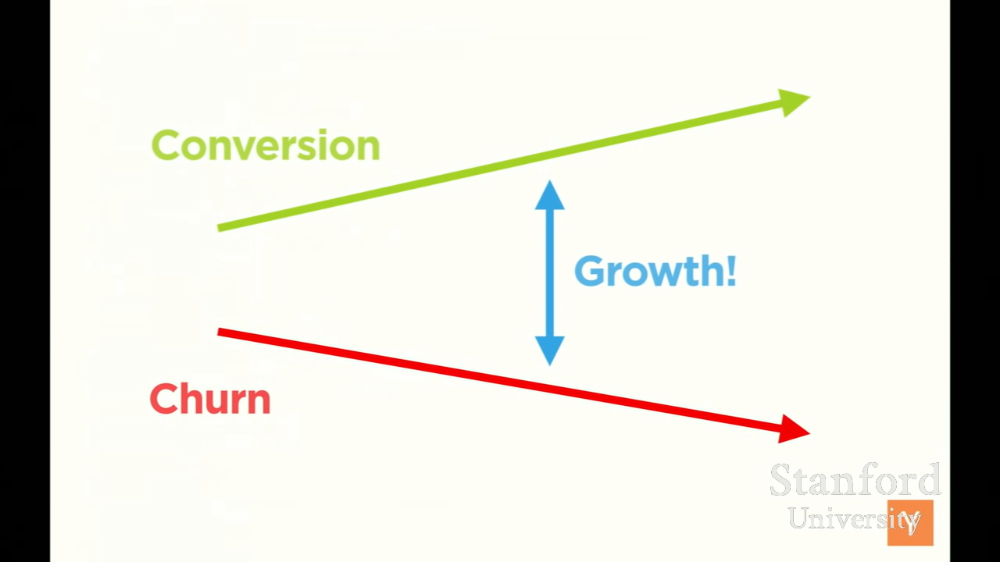

Khái niệm:: 

Nguồn:: [Y Combinator](../../../../%CE%9E%20Ngu%E1%BB%93n/Y%20Combinator.md), <iframe width="560" height="315" src="https://www.youtube.com/embed/watch?v=sz_LgBAGYyo" title="YouTube video player" frameborder="0" allow="accelerometer; autoplay; clipboard-write; encrypted-media; gyroscope; picture-in-picture; web-share" referrerpolicy="strict-origin-when-cross-origin" allowfullscreen></iframe>

[Tỉ lệ quay lại là thứ quan trọng nhất trong tăng trưởng](./T%E1%BB%89%20l%E1%BB%87%20quay%20l%E1%BA%A1i%20l%C3%A0%20th%E1%BB%A9%20quan%20tr%E1%BB%8Dng%20nh%E1%BA%A5t%20trong%20t%C4%83ng%20tr%C6%B0%E1%BB%9Fng.md)