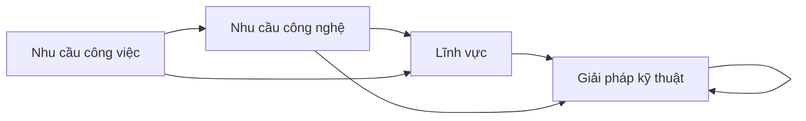

# Tiêu chí lựa chọn
- Là những nhu cầu liên quan đến lập trình,
- Thường đủ phức tạp để các giải pháp làm sẵn hoặc AI không đáp ứng hiệu quả được 
- Thường xuất hiện ở các tổ chức, dự án nhỏ, vốn không có nhiều tiền để thuê ngoài
- Thường tự làm thì sẽ làm chủ động và hiệu quả hơn là để người khác làm
- Việc tự học để giải quyết nhu cầu thường tạo cảm giác bị phân tán sự tập trung khỏi công việc quan trọng hơn

# Nhận xét
Việc có hiểu biết về một lĩnh vực hoặc một giải pháp kỹ thuật sẽ giúp giải quyết các nhu cầu đòi hỏi kiến thức về lĩnh vực/giải pháp kỹ thuật đó. Nên nếu lĩnh vực/giải pháp kỹ thuật ta am hiểu càng có nhiều nhu cầu đổ về nó, thì ta sẽ càng linh hoạt hơn trong tương lai. 

# Lưu ý khác
Các giải pháp kỹ thuật chỉ là những giải pháp thường được dùng, không nhất thiết là giải pháp duy nhất.

Phiên bản đồ thị: 0.2. Bài chi tiết sẽ có phiên bản mới nhất cùng với các hoạt động hỗ trợ đáp ứng các nhu cầu này: https://quảcầu.cc/nhucầulậptrình.

[Để có thể thiết kế một giải pháp một cách nhanh chóng và tự tin, ta cần được thử nghiệm ý tưởng mới và kiểm tra giả thiết ngay khi chúng vừa được nghĩ ra](../../../%E2%9A%A1Hi%E1%BB%83u%20bi%E1%BA%BFt%20s%C3%A2u/Qu%E1%BA%A3n%20l%C3%BD%20d%E1%BB%B1%20%C3%A1n,%20ph%C3%A1t%20tri%E1%BB%83n%20s%E1%BA%A3n%20ph%E1%BA%A9m,%20x%C3%A2y%20d%E1%BB%B1ng%20t%E1%BB%95%20ch%E1%BB%A9c/Ph%C3%A1t%20tri%E1%BB%83n%20s%E1%BA%A3n%20ph%E1%BA%A9m/Ki%E1%BB%83m%20%C4%91%E1%BB%8Bnh%20gi%E1%BA%A3%20thuy%E1%BA%BFt/%C4%90%E1%BB%83%20c%C3%B3%20th%E1%BB%83%20thi%E1%BA%BFt%20k%E1%BA%BF%20m%E1%BB%99t%20gi%E1%BA%A3i%20ph%C3%A1p%20m%E1%BB%99t%20c%C3%A1ch%20nhanh%20ch%C3%B3ng%20v%C3%A0%20t%E1%BB%B1%20tin,%20ta%20c%E1%BA%A7n%20%C4%91%C6%B0%E1%BB%A3c%20th%E1%BB%AD%20nghi%E1%BB%87m%20%C3%BD%20t%C6%B0%E1%BB%9Fng%20m%E1%BB%9Bi%20v%C3%A0%20ki%E1%BB%83m%20tra%20gi%E1%BA%A3%20thi%E1%BA%BFt%20ngay%20khi%20ch%C3%BAng%20v%E1%BB%ABa%20%C4%91%C6%B0%E1%BB%A3c%20ngh%C4%A9%20ra.md) — Bret Victor, Up and Down the Ladder of Abstraction

---

Theo sơ đồ trên, thì không nên tạo liên kết ở một ghi chú về lĩnh vực đến ghi chú về nhu cầu công nghệ. [Sắp chữ, thiết kế, xuất bản](./L%C4%A9nh%20v%E1%BB%B1c/S%E1%BA%AFp%20ch%E1%BB%AF,%20thi%E1%BA%BFt%20k%E1%BA%BF,%20xu%E1%BA%A5t%20b%E1%BA%A3n.md) là một lĩnh vực. Nhưng khi làm thì cảm giác rất muốn để nhu cầu công nghệ là [WYSIWYM](./Nhu%20c%E1%BA%A7u%20c%C3%B4ng%20ngh%E1%BB%87/WYSIWYM.md), và nhu cầu công việc là [Dễ dàng chèn ảnh, bảng, sơ đồ, mục lục, ghi chú, song ngữ, trích dẫn theo đúng ý](./Nhu%20c%E1%BA%A7u%20c%C3%B4ng%20vi%E1%BB%87c/Nghi%C3%AAn%20c%E1%BB%A9u/D%E1%BB%85%20d%C3%A0ng%20ch%C3%A8n%20%E1%BA%A3nh,%20b%E1%BA%A3ng,%20s%C6%A1%20%C4%91%E1%BB%93,%20m%E1%BB%A5c%20l%E1%BB%A5c,%20ghi%20ch%C3%BA,%20song%20ng%E1%BB%AF,%20tr%C3%ADch%20d%E1%BA%ABn%20theo%20%C4%91%C3%BAng%20%C3%BD.md), vì chỉ thấy việc sắp chữ chỉ có cái này.

Tuy nhiên để ý là [Nhân văn số](./L%C4%A9nh%20v%E1%BB%B1c/Nh%C3%A2n%20v%C4%83n%20s%E1%BB%91.md) cũng là một lĩnh vực, mà không thấy cần để nhu cầu công nghệ là [Xác định các chủ đề có trong ngữ liệu](./Nhu%20c%E1%BA%A7u%20c%C3%B4ng%20ngh%E1%BB%87/X%C3%A1c%20%C4%91%E1%BB%8Bnh%20c%C3%A1c%20ch%E1%BB%A7%20%C4%91%E1%BB%81%20c%C3%B3%20trong%20ng%E1%BB%AF%20li%E1%BB%87u.md), và nhu cầu công việc là [Nắm bắt xu hướng mạng](./Nhu%20c%E1%BA%A7u%20c%C3%B4ng%20vi%E1%BB%87c/Doanh%20nghi%E1%BB%87p%20ho%E1%BA%B7c%20t%E1%BB%95%20ch%E1%BB%A9c/N%E1%BA%AFm%20b%E1%BA%AFt%20xu%20h%C6%B0%E1%BB%9Bng%20m%E1%BA%A1ng.md) hay [Nghiên cứu cộng đồng mạng](./Nhu%20c%E1%BA%A7u%20c%C3%B4ng%20vi%E1%BB%87c/Nghi%C3%AAn%20c%E1%BB%A9u/Nghi%C3%AAn%20c%E1%BB%A9u%20c%E1%BB%99ng%20%C4%91%E1%BB%93ng%20m%E1%BA%A1ng.md), vì tự thấy rằng nhân văn số còn nhiều thứ hơn cái này
