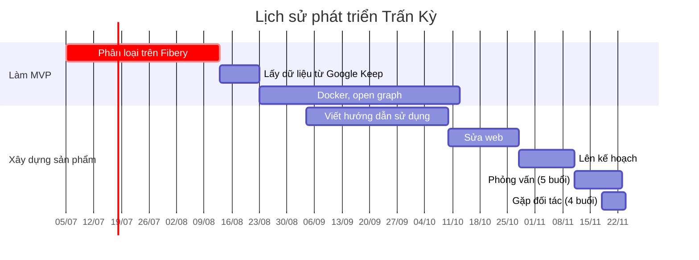

# Điều nhà đầu tư quan tâm
## Trấn Kỳ là gì
Phân loại chi tiêu hoặc các dạng dữ liệu khác một cách tự động chỉ bằng lời nói mình dùng thường ngày và tự động đưa vào bảng excel. 

## Tiềm năng thị trường
Hiện nay có vẻ tới nay chưa có ai làm cái này. Thứ gần nhất là MoneyLover sau 5 năm vẫn chỉ có 50k download, chứng tỏ nó vẫn còn quá bé, vẫn chưa chiếm lĩnh được thị trường. Khi nào có ai đó chiếm trên 70% thì mới không nên tham gia. 

Nhóm đối tượng học sinh sinh viên sẽ là những người sẵn sàng tham gia nhất, và họ cũng dễ chuyển đổi thành khách hàng cho các ngân hàng nhất.

## Các thành tựu

## Khám phá sâu sắc
Có những người sử dụng chương trình này không chỉ để phân loại thu chi, mà còn để phân loại các loại dữ liệu khác, cũng như kết hợp vào hệ thống hoạch định tài nguyên doanh nghiệp của họ.

Bài chi tiết: [Lý do viết Trấn Kỳ](../../9%20Blog/L%C3%BD%20do%20vi%E1%BA%BFt%20Tr%E1%BA%A5n%20K%E1%BB%B3.md){ .md-button .md-button--primary }

## Mô hình kinh doanh
- SaaS: tính theo số lượng giao dịch hoặc plugin
- Chợ/hoạt động cộng đồng
- Bán dữ liệu
- Gia công cho các công ty

Bài chi tiết: [Mô hình kinh doanh](./M%C3%B4%20h%C3%ACnh%20kinh%20doanh.md){ .md-button .md-button--primary }

## Đội ngũ
- Lý Minh Nhật: tech, fulltime 
- Nguyễn Đức Thịnh: nhân sự
- Nguyễn Hữu Lộc: tech 2
- Mai Quang: cố vấn kinh doanh, phát triển sản phẩm, bán hàng
- Đỗ Hàng Minh Trí: cố vấn kinh doanh

Về trung bình, 4/5 người đã làm việc với nhau hơn 2 năm cùng Quả Cầu.

# Điều muốn nhà đầu tư quan tâm
## Trấn Kỳ được sinh ra là để giúp Kendy
[Lý do viết Trấn Kỳ](../../9%20Blog/L%C3%BD%20do%20vi%E1%BA%BFt%20Tr%E1%BA%A5n%20K%E1%BB%B3.md), [Kế hoạch giúp Kendy](../K%E1%BA%BF%20ho%E1%BA%A1ch/K%E1%BA%BF%20ho%E1%BA%A1ch%20gi%C3%BAp%20Kendy.md)

## Sức khoẻ cũng là một loại tài nguyên cần được tối ưu hoá
- [Dựa vào KPI thì bộ phận kinh doanh sẽ có tiếng nói lớn nhất. Đội phát triển sản phẩm rất ít có tiếng nói](../../../../%E2%9A%A1Hi%E1%BB%83u%20bi%E1%BA%BFt%20s%C3%A2u/Qu%E1%BA%A3n%20l%C3%BD%20d%E1%BB%B1%20%C3%A1n,%20ph%C3%A1t%20tri%E1%BB%83n%20s%E1%BA%A3n%20ph%E1%BA%A9m,%20x%C3%A2y%20d%E1%BB%B1ng%20t%E1%BB%95%20ch%E1%BB%A9c/Ph%C3%A1t%20tri%E1%BB%83n%20s%E1%BA%A3n%20ph%E1%BA%A9m/D%E1%BB%B1a%20v%C3%A0o%20KPI%20th%C3%AC%20b%E1%BB%99%20ph%E1%BA%ADn%20kinh%20doanh%20s%E1%BA%BD%20c%C3%B3%20ti%E1%BA%BFng%20n%C3%B3i%20l%E1%BB%9Bn%20nh%E1%BA%A5t.%20%C4%90%E1%BB%99i%20ph%C3%A1t%20tri%E1%BB%83n%20s%E1%BA%A3n%20ph%E1%BA%A9m%20r%E1%BA%A5t%20%C3%ADt%20c%C3%B3%20ti%E1%BA%BFng%20n%C3%B3i.md)
- [Thứ quyết định hiệu quả của việc kinh doanh là văn hoá doanh nghiệp và phản ứng của thị trường về mình](../../../../%E2%9A%A1Hi%E1%BB%83u%20bi%E1%BA%BFt%20s%C3%A2u/Qu%E1%BA%A3n%20l%C3%BD%20d%E1%BB%B1%20%C3%A1n,%20ph%C3%A1t%20tri%E1%BB%83n%20s%E1%BA%A3n%20ph%E1%BA%A9m,%20x%C3%A2y%20d%E1%BB%B1ng%20t%E1%BB%95%20ch%E1%BB%A9c/G%C3%A2y%20qu%E1%BB%B9/G%E1%BB%8Dn%20v%E1%BB%91n%20%C4%91%E1%BA%A7u%20t%C6%B0/Th%E1%BB%A9%20quy%E1%BA%BFt%20%C4%91%E1%BB%8Bnh%20hi%E1%BB%87u%20qu%E1%BA%A3%20c%E1%BB%A7a%20vi%E1%BB%87c%20kinh%20doanh%20l%C3%A0%20v%C4%83n%20ho%C3%A1%20doanh%20nghi%E1%BB%87p%20v%C3%A0%20ph%E1%BA%A3n%20%E1%BB%A9ng%20c%E1%BB%A7a%20th%E1%BB%8B%20tr%C6%B0%E1%BB%9Dng%20v%E1%BB%81%20m%C3%ACnh.md)
- [Phân tích quyết định đa tiêu chí (MCDA) là phương pháp để tìm điểm đánh đổi tối ưu nhất](../../../../%E2%9A%A1Hi%E1%BB%83u%20bi%E1%BA%BFt%20s%C3%A2u/Kinh%20t%E1%BA%BF%20h%E1%BB%8Dc%20v%C3%A0%20ch%E1%BB%A7%20ngh%C4%A9a%20t%C3%A2n%20t%E1%BB%B1%20do.%20T%C3%A2m%20l%C3%BD%20h%E1%BB%8Dc%20qu%E1%BA%A3n%20l%C3%BD%20v%C3%A0%20lao%20%C4%91%E1%BB%99ng/Kinh%20t%E1%BA%BF%20h%E1%BB%8Dc,%20ch%E1%BB%A7%20ngh%C4%A9a%20t%C3%A2n%20t%E1%BB%B1%20do/Ph%C3%A2n%20t%C3%ADch%20quy%E1%BA%BFt%20%C4%91%E1%BB%8Bnh%20%C4%91a%20ti%C3%AAu%20ch%C3%AD%20(MCDA)%20l%C3%A0%20ph%C6%B0%C6%A1ng%20ph%C3%A1p%20%C4%91%E1%BB%83%20t%C3%ACm%20%C4%91i%E1%BB%83m%20%C4%91%C3%A1nh%20%C4%91%E1%BB%95i%20t%E1%BB%91i%20%C6%B0u%20nh%E1%BA%A5t.md) 
- [Nếu bạn nghĩ rằng bạn có thể hoàn thành đúng kế hoạch, có thể bạn đang ngộ nhận](../../../../%E2%9A%A1Hi%E1%BB%83u%20bi%E1%BA%BFt%20s%C3%A2u/C%E1%BB%99ng%20%C4%91%E1%BB%93ng,%20h%E1%BB%87%20sinh%20th%C3%A1i,%20h%E1%BB%87%20ph%E1%BB%A9c%20h%E1%BB%A3p/H%E1%BB%87%20ph%E1%BB%A9c%20h%E1%BB%A3p/N%E1%BA%BFu%20b%E1%BA%A1n%20ngh%C4%A9%20r%E1%BA%B1ng%20b%E1%BA%A1n%20c%C3%B3%20th%E1%BB%83%20ho%C3%A0n%20th%C3%A0nh%20%C4%91%C3%BAng%20k%E1%BA%BF%20ho%E1%BA%A1ch,%20c%C3%B3%20th%E1%BB%83%20b%E1%BA%A1n%20%C4%91ang%20ng%E1%BB%99%20nh%E1%BA%ADn.md)
- [Nỗi ám ảnh với sự hiệu quả có thể đến từ nỗi sợ chết](../../../../%E2%9A%A1Hi%E1%BB%83u%20bi%E1%BA%BFt%20s%C3%A2u/Kinh%20t%E1%BA%BF%20h%E1%BB%8Dc%20v%C3%A0%20ch%E1%BB%A7%20ngh%C4%A9a%20t%C3%A2n%20t%E1%BB%B1%20do.%20T%C3%A2m%20l%C3%BD%20h%E1%BB%8Dc%20qu%E1%BA%A3n%20l%C3%BD%20v%C3%A0%20lao%20%C4%91%E1%BB%99ng/T%C3%A2m%20l%C3%BD%20h%E1%BB%8Dc%20qu%E1%BA%A3n%20l%C3%BD%20v%C3%A0%20lao%20%C4%91%E1%BB%99ng/N%E1%BB%97i%20%C3%A1m%20%E1%BA%A3nh%20v%E1%BB%9Bi%20s%E1%BB%B1%20hi%E1%BB%87u%20qu%E1%BA%A3%20c%C3%B3%20th%E1%BB%83%20%C4%91%E1%BA%BFn%20t%E1%BB%AB%20n%E1%BB%97i%20s%E1%BB%A3%20ch%E1%BA%BFt.md)

## Động lực nội sinh và sự tin tưởng tạo ra tổ chức đáng làm
- [Nhìn thấy được người kia đang làm gì làm tăng sự tin tưởng đối với họ](../../../../%E2%9A%A1Hi%E1%BB%83u%20bi%E1%BA%BFt%20s%C3%A2u/Qu%E1%BA%A3n%20l%C3%BD%20d%E1%BB%B1%20%C3%A1n,%20ph%C3%A1t%20tri%E1%BB%83n%20s%E1%BA%A3n%20ph%E1%BA%A9m,%20x%C3%A2y%20d%E1%BB%B1ng%20t%E1%BB%95%20ch%E1%BB%A9c/X%C3%A2y%20d%E1%BB%B1ng,%20qu%E1%BA%A3n%20l%C3%BD%20nh%C3%B3m/Nh%C3%ACn%20th%E1%BA%A5y%20%C4%91%C6%B0%E1%BB%A3c%20ng%C6%B0%E1%BB%9Di%20kia%20%C4%91ang%20l%C3%A0m%20g%C3%AC%20l%C3%A0m%20t%C4%83ng%20s%E1%BB%B1%20tin%20t%C6%B0%E1%BB%9Fng%20%C4%91%E1%BB%91i%20v%E1%BB%9Bi%20h%E1%BB%8D.md)
- [Một tổ chức đáng làm tạo ra được động lực nội sinh ở nhân viên](../../../../%E2%9A%A1Hi%E1%BB%83u%20bi%E1%BA%BFt%20s%C3%A2u/Kinh%20t%E1%BA%BF%20h%E1%BB%8Dc%20v%C3%A0%20ch%E1%BB%A7%20ngh%C4%A9a%20t%C3%A2n%20t%E1%BB%B1%20do.%20T%C3%A2m%20l%C3%BD%20h%E1%BB%8Dc%20qu%E1%BA%A3n%20l%C3%BD%20v%C3%A0%20lao%20%C4%91%E1%BB%99ng/T%C3%A2m%20l%C3%BD%20h%E1%BB%8Dc%20qu%E1%BA%A3n%20l%C3%BD%20v%C3%A0%20lao%20%C4%91%E1%BB%99ng/K%E1%BB%B9%20n%C4%83ng,%20%C4%91%E1%BB%99ng%20l%E1%BB%B1c/M%E1%BB%99t%20t%E1%BB%95%20ch%E1%BB%A9c%20%C4%91%C3%A1ng%20l%C3%A0m%20t%E1%BA%A1o%20ra%20%C4%91%C6%B0%E1%BB%A3c%20%C4%91%E1%BB%99ng%20l%E1%BB%B1c%20n%E1%BB%99i%20sinh%20%E1%BB%9F%20nh%C3%A2n%20vi%C3%AAn.md)

## Quả Cầu là một vùng đất, một sân chơi, một cộng đồng, một mạng lưới, một nền tảng, một hệ sinh thái
Nó là một khái niệm lơ lửng, một vật thể trong suốt. Quả Cầu hướng đến việc trở thành một tổ chức không có sự phân cấp và người tham gia không làm vì trách nhiệm, lấy nhu cầu của thành viên (vốn nhiều vô kể và thay đổi liên tục) làm mục tiêu của tổ chức, để họ trở thành những người có kỹ năng đa dạng, tư duy liên ngành, và sự khoẻ mạnh và hạnh phúc toàn diện, dựa trên triết học của Deleuze và Guattari, khoa học phức hợp, game phiêu lưu nhập vai, nền kinh tế không dùng tiền, và các công cụ lưu dữ liệu tại máy người dùng.